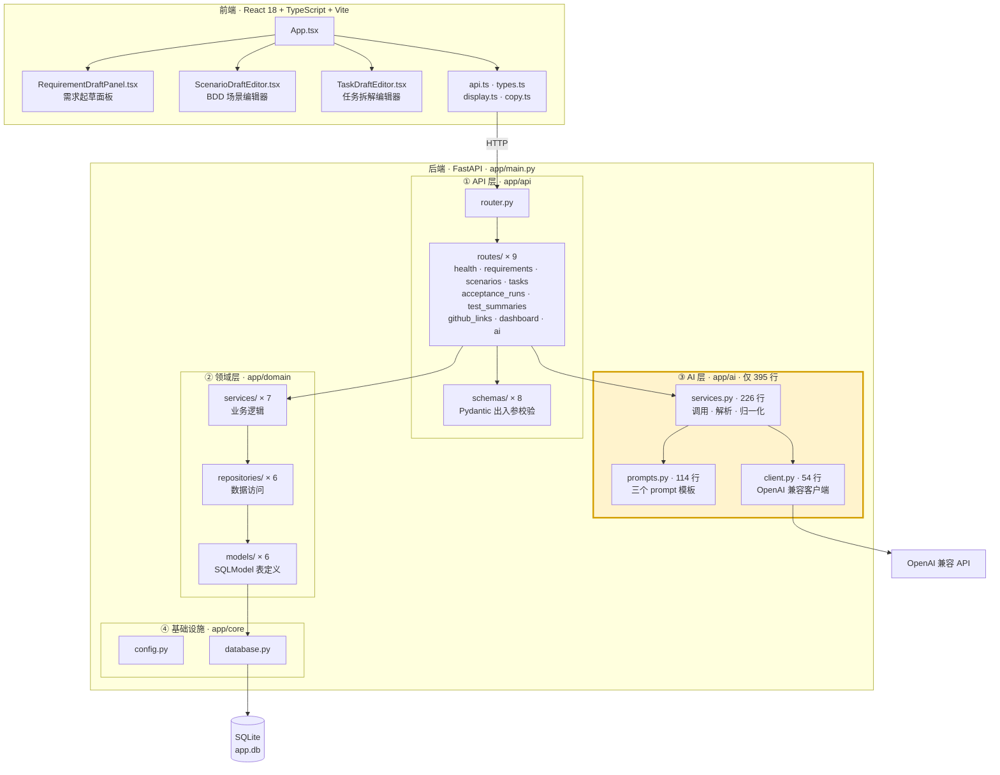
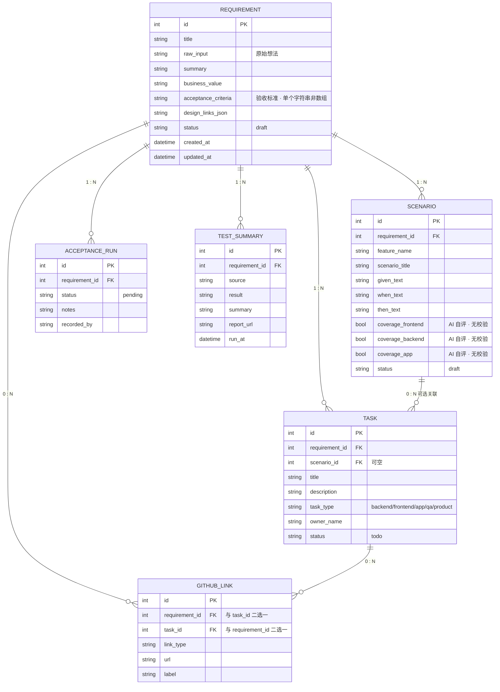
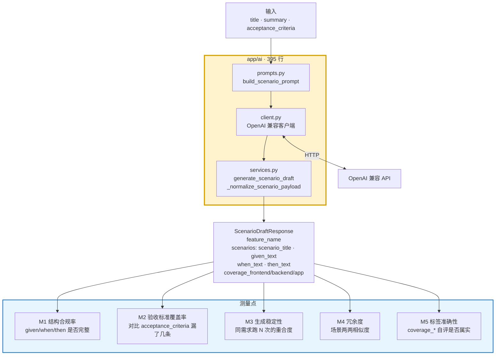

# Architecture

代码架构图。与现有文档的分工:

| 文档 | 内容 |
|---|---|
| [`mermaid.md`](mermaid.md) | **业务流程图** —— 系统泳道、角色泳道、业务决策流 |
| [`TECH_DESIGN.md`](TECH_DESIGN.md) | 技术选型与组件的**文字**说明 |
| [`DB_SCHEMA.md`](DB_SCHEMA.md) | 表结构的**文字**说明 |
| **本文件** | **代码架构图** —— 分层、数据模型关系、AI 层测量点 |

---

## 1. 分层架构



**要点:AI 层是独立的一层,不经过领域层和数据库。** `routes/ai.py` 直接调 `app/ai/services.py`,拿到草稿返回前端,由用户决定是否保存 —— 保存才走领域层落库。

这意味着 **AI 部分可以完全独立拎出来运行**,不需要数据库、不需要登录、不需要前端。

---

## 2. 数据模型关系



**要点:一切围绕 `Requirement`。** 五个子实体全部外键指向它;`Task` 可额外挂到某个 `Scenario`;`GitHubLink` 挂需求或挂任务,二选一。

> ⚠️ **文档与代码不一致**:`DB_SCHEMA.md` 第 2.7 节描述了 `ai_generation_records` 表,但 `app/domain/models/` 下只有上述 6 个模型,**该表未实现**。见下节。

---

## 3. AI 层与测量点



### 为什么这一层适合做质量评测

| 特性 | 说明 |
|---|---|
| **纯函数** | 输入文本 → 输出 JSON,不依赖数据库、登录、被测系统 |
| **体量极小** | 395 行,三个文件,全部可读 |
| **输出有结构** | Pydantic schema 约束,可机器判分 |
| **门槛低** | 一台笔记本 + 一个 API key 即可跑完整实验 |

### 已知的两个待验证点

**① `SCENARIO_SYSTEM_PROMPT` 有重复行**

`app/ai/prompts.py` 中,scenario 的 system prompt 里这一行出现了两次:

```
The source input may be Chinese or English. Understand both and respond in the same language as the user input.
```

requirement 和 task 的 prompt 均无此重复。可作为 A/B 实验变量。

**② `coverage_frontend / backend / app` 无任何校验**

三个布尔字段由模型自行填写,代码中没有任何地方验证其正确性。属于典型的"模型自评"未验证问题,对应上图 M5。

### 缺失的记录能力

`DB_SCHEMA.md` 设计但未实现的 `ai_generation_records` 表,正是评测工作所需的基础设施 —— 它能持久化每次 AI 调用的输入、输出和元数据,作为评测数据集的来源。若开展评测,建议优先补齐该表或以文件形式记录。
