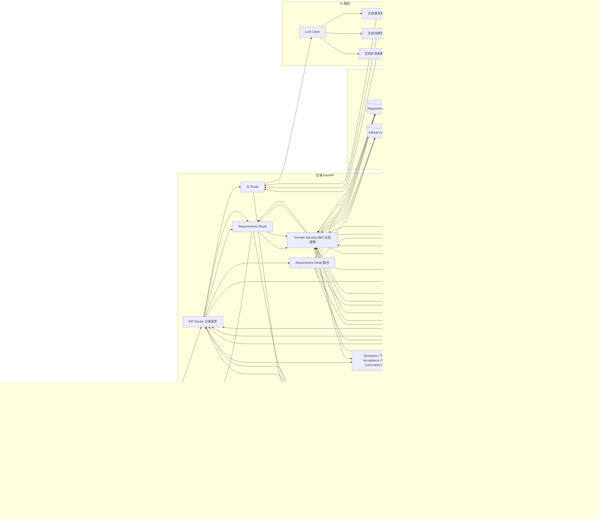
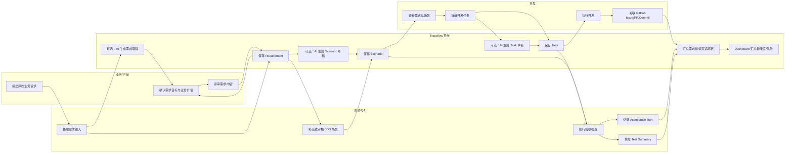
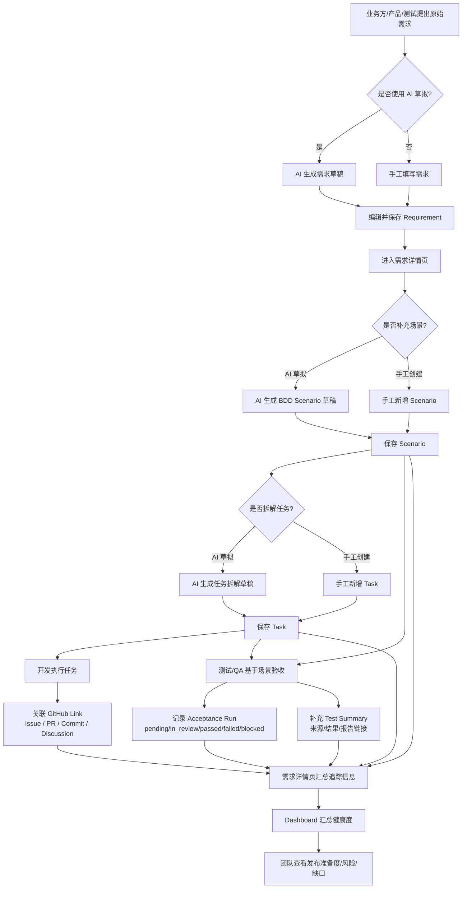

**“前端 / 后端 / 数据库 / AI 服务”的系统泳道图**

```mermaid
flowchart LR
    subgraph U[用户]
        U1[打开工作台 / Dashboard]
        U2[录入原始需求]
        U3[选择 AI 草拟或手工保存]
        U4[补充场景 / 任务 / 验收 / 链接 / 测试摘要]
        U5[查看需求详情与 Dashboard]
    end

    subgraph F[前端 React]
        F1[App 加载列表与视图状态]
        F2[调用需求列表接口]
        F3[调用 AI 草稿接口]
        F4[调用 Requirement 保存接口]
        F5[调用 Requirement Detail 聚合接口]
        F6[调用 Scenario / Task / Acceptance / Link / Summary 接口]
        F7[调用 Dashboard Summary 接口]
        F8[渲染工作台与仪表盘]
    end

    subgraph B[后端 FastAPI]
        B1[API Router 分发请求]
        B2[Requirements Route]
        B3[AI Route]
        B4[Scenarios / Tasks / Acceptance / Links / Summaries Route]
        B5[Requirement Detail 聚合]
        B6[Dashboard Service 汇总]
        B7[Domain Services 执行业务逻辑]
    end

    subgraph D[SQLite 数据库]
        D1[(Requirements)]
        D2[(Scenarios)]
        D3[(Tasks)]
        D4[(Acceptance Runs)]
        D5[(GitHub Links)]
        D6[(Test Summaries)]
    end

    subgraph A[AI 服务]
        A1[LLM Client]
        A2[生成需求草稿]
        A3[生成场景草稿]
        A4[生成任务拆解草稿]
    end

    U1 --> F1
    F1 --> F2
    F2 --> B1
    B1 --> B2
    B2 --> B7
    B7 --> D1
    D1 --> B7
    B7 --> B2
    B2 --> F2
    F2 --> F8

    U2 --> F8
    U3 --> F3
    F3 --> B1
    B1 --> B3
    B3 --> A1
    A1 --> A2
    A1 --> A3
    A1 --> A4
    A2 --> B3
    A3 --> B3
    A4 --> B3
    B3 --> F3
    F3 --> F8

    U3 --> F4
    F4 --> B1
    B1 --> B2
    B2 --> B7
    B7 --> D1
    D1 --> B7
    B7 --> B2
    B2 --> F4
    F4 --> F5

    F5 --> B1
    B1 --> B5
    B5 --> D1
    B5 --> D2
    B5 --> D3
    B5 --> D4
    B5 --> D5
    B5 --> D6
    B5 --> F5
    F5 --> F8

    U4 --> F6
    F6 --> B1
    B1 --> B4
    B4 --> B7
    B7 --> D2
    B7 --> D3
    B7 --> D4
    B7 --> D5
    B7 --> D6
    D2 --> B7
    D3 --> B7
    D4 --> B7
    D5 --> B7
    D6 --> B7
    B7 --> B4
    B4 --> F6
    F6 --> F5
    F5 --> F8

    U5 --> F7
    F7 --> B1
    B1 --> B6
    B6 --> D1
    B6 --> D2
    B6 --> D3
    B6 --> D4
    B6 --> D6
    D1 --> B6
    D2 --> B6
    D3 --> B6
    D4 --> B6
    D6 --> B6
    B6 --> F7
    F7 --> F8

```

**“泳道版流程图”**

```mermaid
flowchart LR
    %% Swimlanes
    subgraph L1[业务/产品]
        A1[提出原始业务诉求]
        A2[确认需求目标与业务价值]
        A3[评审需求内容]
    end

    subgraph L2[测试/QA]
        B1[整理需求输入]
        B2[补充或审核 BDD 场景]
        B3[执行验收检查]
        B4[记录 Acceptance Run]
        B5[填写 Test Summary]
    end

    subgraph L3[开发]
        C1[查看需求与场景]
        C2[拆解开发任务]
        C3[执行开发]
        C4[关联 GitHub Issue/PR/Commit]
    end

    subgraph L4[Traceflow 系统]
        D1[可选：AI 生成需求草稿]
        D2[保存 Requirement]
        D3[可选：AI 生成 Scenario 草稿]
        D4[保存 Scenario]
        D5[可选：AI 生成 Task 草稿]
        D6[保存 Task]
        D7[汇总需求详情页追踪链]
        D8[Dashboard 汇总健康度/风险]
    end

    A1 --> B1
    B1 --> D1
    B1 --> D2
    D1 --> A2
    D2 --> A2
    A2 --> A3
    A3 --> D2

    D2 --> D3
    D2 --> B2
    B2 --> D4
    D3 --> D4

    D4 --> C1
    C1 --> C2
    C2 --> D5
    C2 --> D6
    D5 --> D6

    D6 --> C3
    C3 --> C4
    C4 --> D7

    D4 --> B3
    D6 --> B3
    B3 --> B4
    B3 --> B5

    B4 --> D7
    B5 --> D7
    D7 --> D8

```

**“业务流程图”**

```mermaid
flowchart TD
    A[业务方/产品/测试提出原始需求] --> B{是否使用 AI 草拟?}

    B -- 是 --> C[AI 生成需求草稿]
    B -- 否 --> D[手工填写需求]

    C --> E[编辑并保存 Requirement]
    D --> E

    E --> F[进入需求详情页]
    F --> G{是否补充场景?}

    G -- AI 草拟 --> H[AI 生成 BDD Scenario 草稿]
    G -- 手工创建 --> I[手工新增 Scenario]
    H --> J[保存 Scenario]
    I --> J

    J --> K{是否拆解任务?}
    K -- AI 草拟 --> L[AI 生成任务拆解草稿]
    K -- 手工创建 --> M[手工新增 Task]
    L --> N[保存 Task]
    M --> N

    N --> O[开发执行任务]
    O --> P[关联 GitHub Link<br/>Issue / PR / Commit / Discussion]

    J --> Q[测试/QA 基于场景验收]
    N --> Q

    Q --> R[记录 Acceptance Run<br/>pending/in_review/passed/failed/blocked]
    Q --> S[补充 Test Summary<br/>来源/结果/报告链接]

    P --> T[需求详情页汇总追踪信息]
    R --> T
    S --> T
    J --> T
    N --> T

    T --> U[Dashboard 汇总健康度]
    U --> V[团队查看发布准备度/风险/缺口]

```